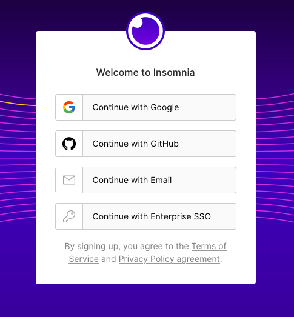
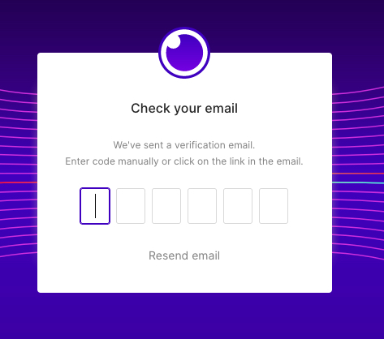
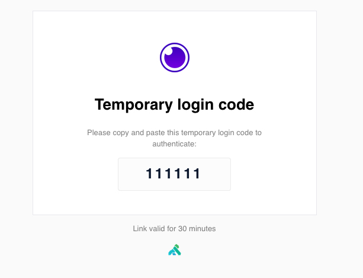
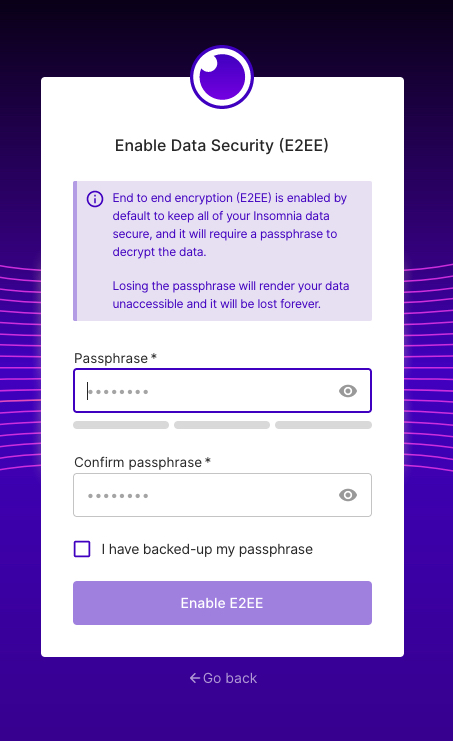
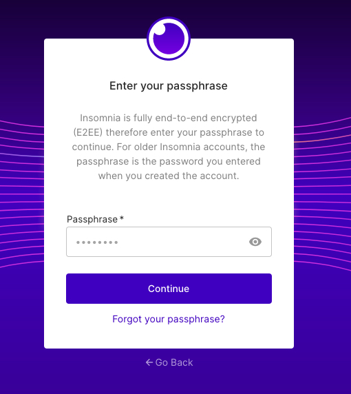
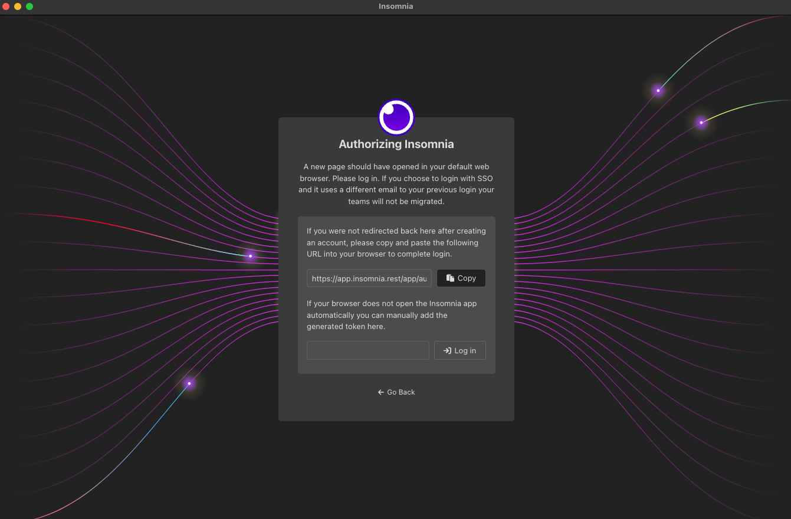

## Creating Your Insomnia Account

### Signing up from the Insomnia Desktop Application

You can Sign Up for Insomnia by clicking on the **Sign Up** button on the top bar of the Insomnia Desktop App, on the right hand side.
[Login and Signup button](!/assets/login-signup.png)

When you click on **Sign Up**, you will be redirected to the [insomnia website](https://app.insomnia.rest/app/authorize) to finish the process.

### Signing up for Insomnia on Insomnia.rest

Once in the insomnia website, you can sign up with one of the following:

- Email address,
- Google account,
- GitHub account,
- Enterprise Single-sign-on account

If you select `Continue with Email address` option, you will receive a verification email with a 6-digit code:

Check your email inbox for the verification code, you should get an email similar to the following:

The verification code is valid for 30 minutes.

### Setting up encryption passphrase

Regardless of the method you choose to sign up an Insomnia account, you will be required to enter an Encryption Passphrase:

End to end encryption (E2EE) is enabled by default to keep all of your Insomnia data secure, and it will require a passphrase to decrypt the data.

{:.alert .alert-primary}
**Note**: Losing the passphrase will render your data unaccessible and it will be lost forever.

Fill in your passphrase, click on ***I have backed-up my password**.

Finally click on **Enable E2EE** to finish the process.  When your account has been created, you will receive an email confirming your account on the email address you registered.

## Signing into Insomnia

### Signing in on the Desktop App

On the top bar of the Insomnia App, click on **login**.

Doing so will redirect you to [Insomnia login](https://app.insomnia.rest/app/authorise/) page on your default browser.  Finish signing in on your browser.

After login, you will be prompted for your encryption passphrase.

On successful login, the browser will automatically reopen your Insomnia Desktop App with active session.

In the top bar on the right hand side, you'll see your name which signifies that you are currently logged in.

#### My Insomnia App didn't Reopen Successfully after Logging in

In the case that login didn't lead to the Insomnia App reopening, you can manually copy your session token from the website:

And then paste the token into the app:

