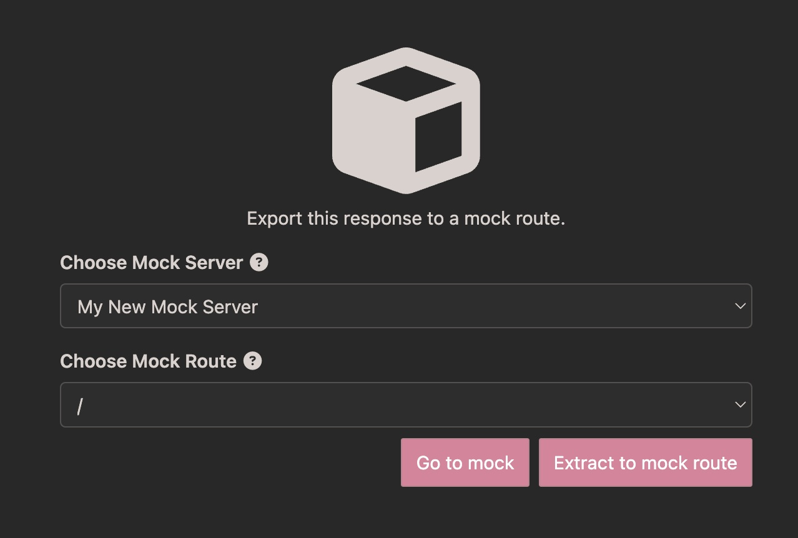

API mocks are useful for simulating an API endpoint. For example, when building a front end while the backend API is under construction and unstable, Insomnia allows us to customize responses from a set of API paths to simulate a static API. This mocked URL can then replace our front-end API backend URL.

## Insomnia Cloud Mocks

Any logged-in user can create API mocks, accessible at [mock.insomnia.rest](https://mock.insomnia.rest). These mocks can be collaborated on with a team and accessed by anyone.

As a consumer of this mock server we can modify our api url to point at the insomnia cloud mock server.

```bash
// Example .env file
BACKEND_API_URL=https://mock_123456789.mock.insomnia.rest/
THIRD_PARTY_API_KEY=xyz
REDIS_PORT=6379
REDIS_HOST=127.0.0.1
```

## Self-hosted Mocks

Enterprise plans have access to self-hosted mocks, providing unrestricted access and more control over usage.

Configuration details can be found at [GitHub - Kong Insomnia Mockbin](https://github.com/kong/insomnia-mockbin) and the Docker image is available at [ghcr.io/kong/insomnia-mockbin:master](https://ghcr.io/kong/insomnia-mockbin:master).

In the following example we are running insomnia-mockbin locally.

```bash
// Example .env file
BACKEND_API_URL=https://localhost:8080/bin/mock_123456789
THIRD_PARTY_API_KEY=xyz
REDIS_PORT=6379
REDIS_HOST=127.0.0.1
```

## Response Extractor

From the request collection screen, on the response pane to the right, we can use the Mock Response tab to extract the most recent response and API path from the currently selected request to build an API mock. This feature is a time-saver when we already have our response structures within Insomnia that we would like to make available from our API mock.


