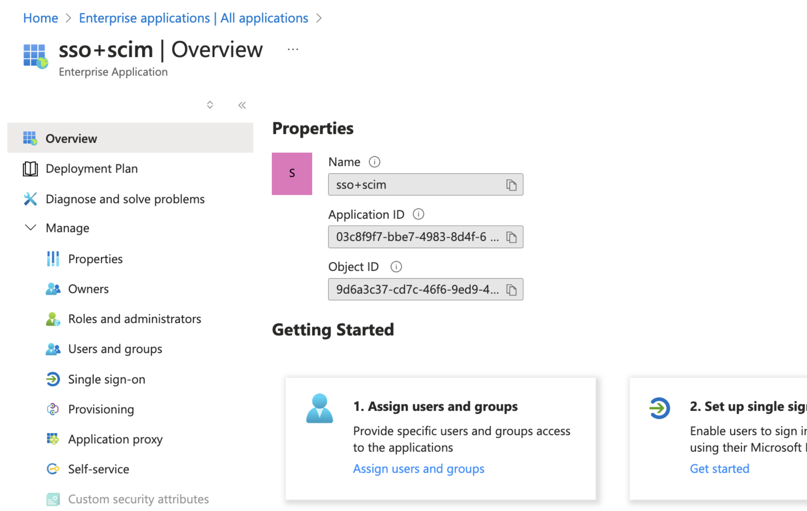

## Configure Enterprise SCIM Provisioning

### What is SCIM Provisioning?

SCIM stands for System for Cross-domain Identity Management. It allows Insomnia to provision enterprise member accounts and Insomnia Teams by your identity provider (like Okta Workspace, Azure Entra or Ping Federate) configured for Single-Sign-On. With such configuration, your identity provider (IDP) becomes the source of truth for your license management. You can assign a new user to a license or de-provision it by a matter of clicks in your IDP.

​​In order to activate Insomnia's SCIM endpoints for your IDP, there are several steps you need to follow; 1. Configure Single-Sign-On, 2. Generate Base Connector URL and Token, 3. Configure your IDP for provisioning.

### 1. Configure Single-Sign-On (SSO)

If you previously set up the SSO already on your IDP side, you might skip this step. However, if your IDP is Azure Entra ID and you used the Entra Gallery to set up the IDP, you need to redo the SSO configure step manually. Please refer to the appropriate link below to get more information.

### 2. Generate Base Connector URL and Token

After configuring the SSO in the Enterprise Controls page, navigate to SCIM menu and click. Once you are in the SCIM page, confirm which identity provider your SSO is configured with if you haven't confirmed yet. Once you do that, you will be able to toggle the switch to enable it.

When toggling the switch on, you will be prompted with a modal where you can follow the instruction. It is very important to note that the token generated is only shown once. Grab the token value as well as the connector URL and move to your IDP SCIM Provisioning page.

### 3. Configure your IDP SAML Application for SCIM

#### Okta
##### 3-1 Navigate to your SAML application App Settings tab and enable Provisioning with SCIM

This will toggle the “Provisioning” tab into the view.

##### 3-2a Navigate to Provisioning tab and set the configuration as the following

In the Integration settings,

a. Paste the SCIM connector base URL from Insomnia SCIM panel into the SCIM connector base URL input
b. Paste the unique identifier from Insomnia SCIM panel into the Unique identifier field for users input
c. Check “Push New Users”, “Push Profile Updates”, “Push Groups” in the “Supported provisioning actions” section. 
d. Select Authentication Mode as “HTTP Header”
e. Paste the Bearer token from Insomnia SCIM panel into the Authorization input
f. Click Test Connector Configuration button to test
g. Click Save

In To App settings,

Check “Create Users” and “Deactivate Users” to be enabled.

#### Azure
##### 3-1 Navigate to your Enterprise application

##### 3-2 Navigate to Provisioning tab and configure your SCIM provisioning

Place the base connector url value to Tenant URL input and put the token into the Secret Token. After placing them, click the “Test Connection” button to test the connection.

##### 3-3 Assign users and groups
Go to the Users and groups tab and click the “Add user/group” button to assign users and groups. Make sure that any users who are part of a group also are assigned to this application.

##### 3-4 Provision the assigned users and group
Navigate to the Provision On-demand page. After selecting the assigned users and groups, click on “Provision” button.
