This guide provides instructions for setting up Single Sign-On (SSO) for Insomnia Enterprise using Azure's Microsoft Entra SAML integration, ensuring secure and efficient user authentication.

#### Configuring Insomnia Enterprise

- **Access Enterprise Controls:** In Insomnia, navigate to "Enterprise Controls."
- **Create SSO Connection:** Click to create a new SSO Connection.
- **SSO Configuration:** Set up your company domain in Insomnia and keep the page open to transfer details between Insomnia and Azure.

#### Setting up Azure Integration

1. **Access Azure Portal:** Open a separate page and go to your Azure Portal.
2. **Navigate to Enterprise Applications:** Go to Microsoft Entra ID > Enterprise Applications.
3. **Add New Application:** In the Microsoft Entra Gallery, select "Microsoft Entra SAML Toolkit."

   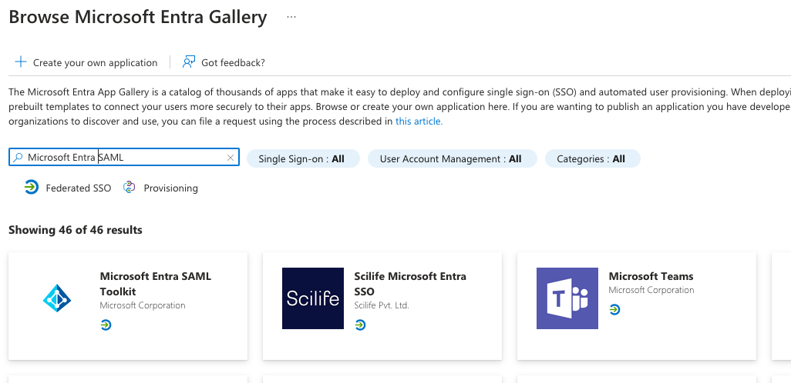

3. **Configure Application:** Rename the toolkit (e.g., "Insomnia") and press "Create."

   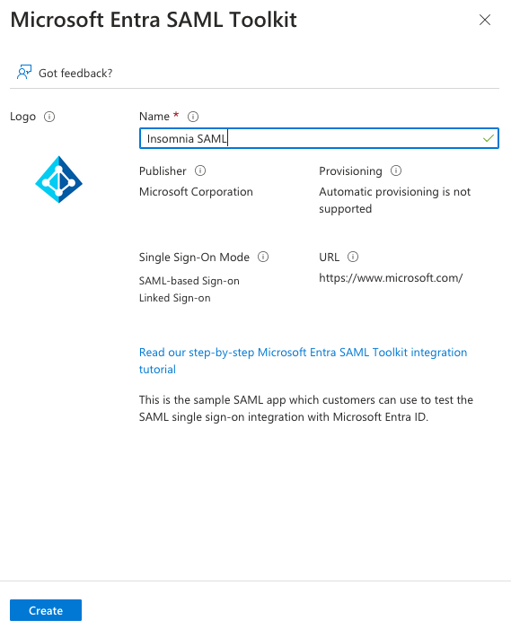

4. **Edit Single-Sign-On Properties:** Access the Single-Sign-On properties for further configuration.

   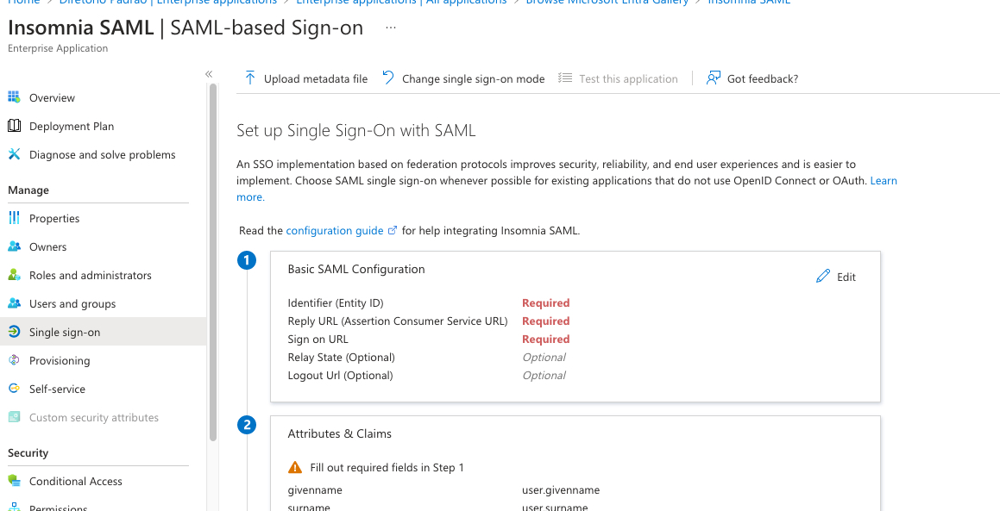

#### Configuring SAML Settings

5. **Basic SAML Configuration:** Copy the Identifier from Insomnia into Azure's Identifier field.

   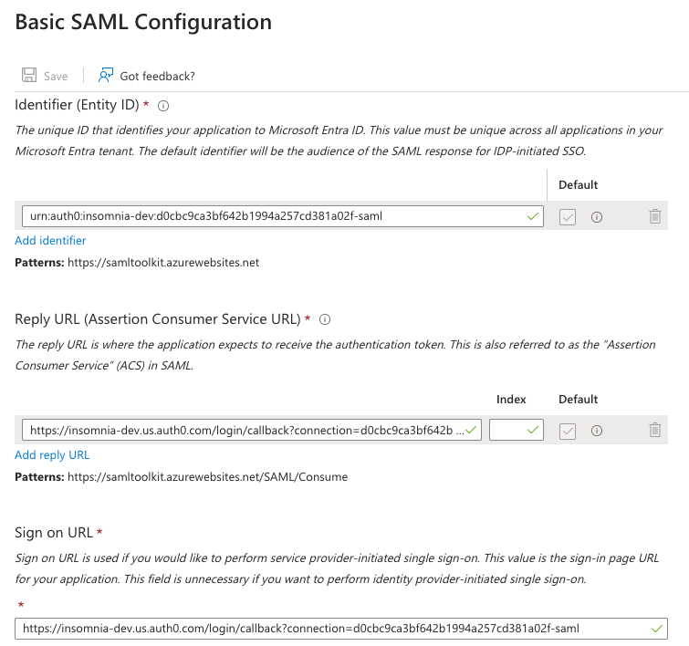

6. **Setting Reply and Sign-On URLs:** Copy the SSO URL from Insomnia into both the Reply URL and the Sign-On URL in Azure.

    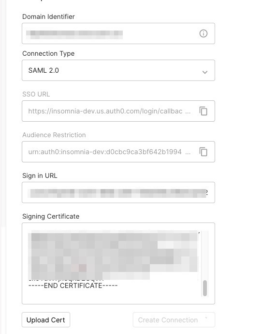

    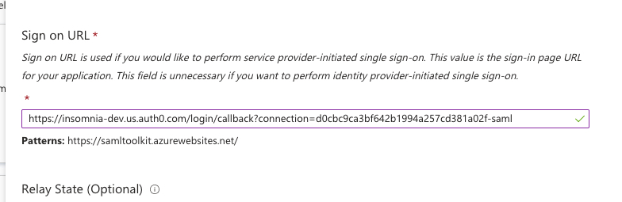

    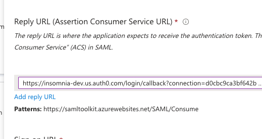

7. **Attributes and Claims:** Create an email attribute in Azure that points to `user.mail`.

    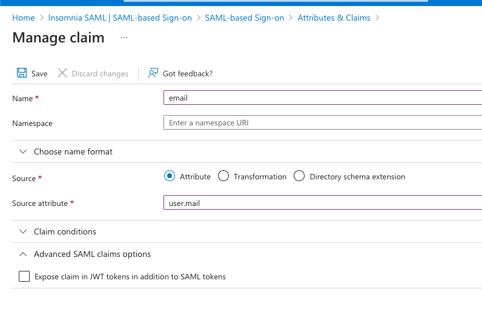

8. **Login URL Transfer:** Copy the Login URL from Azure into Insomnia.

    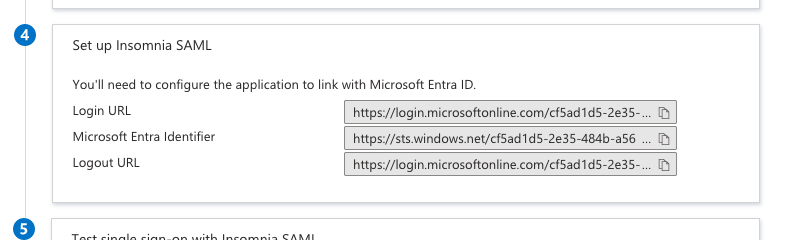

9. **Import Signing Certificate:** Transfer the base64 version of the Signing certificate from Azure to Insomnia.

    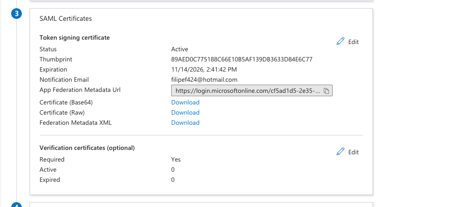

#### Finalizing User Setup

10. **Assign Users in Azure/Entra:** Assign users to the Enterprise application in Azure.

    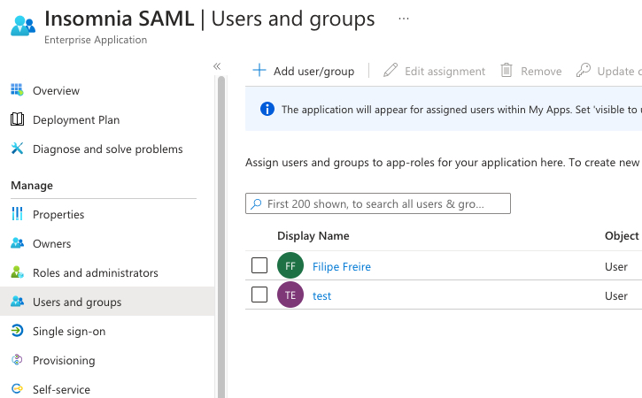

11. **Invite Users in Insomnia:** Invite the same users to your organization in Insomnia.

    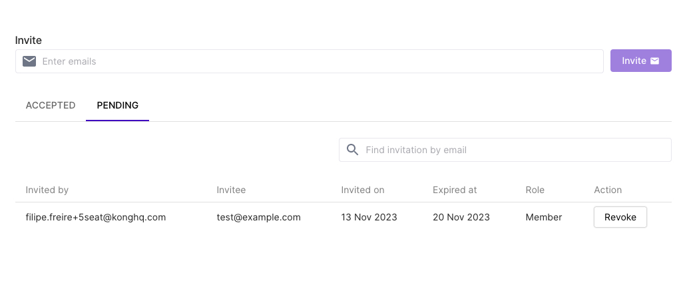

#### Completion

Once these steps are completed, users receiving invites and signing up/logging in via Azure SSO will securely access Insomnia Enterprise.

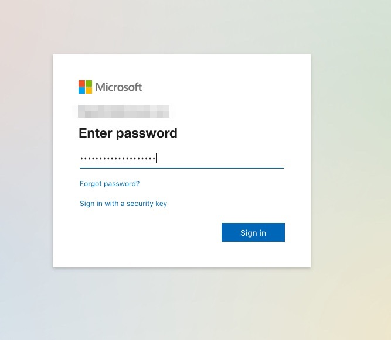

This process ensures a streamlined integration between Insomnia Enterprise and Azure Microsoft Entra SAML for effective SSO implementation.
