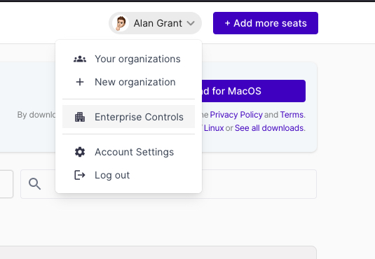
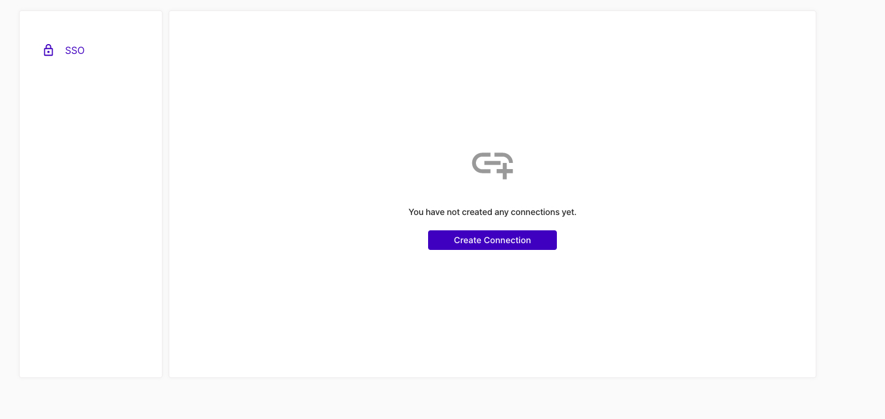
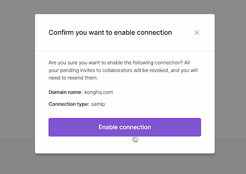
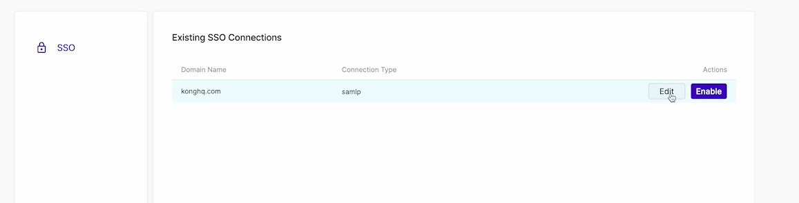

To set up Enterprise Single Sign-On (SSO) using a major SAML 2.0 provider like Okta or Azure in the Insomnia, you need to configure several fields.

The process can slightly differ depending on the SAML provider, but here's a general guide that applies to most cases, using Okta and Azure as examples.

Before setting up Enterprise SSO, you will need

- An active enterprise account with Insomnia.
- An admin account on your SAML provider (e.g., Okta or Azure).
- An organization created after activating your Enterprise license within Insomnia.

### Creating a new SSO connection

- Access Enterprise Controls: In Insomnia, navigate to "Enterprise Controls".

- Create SSO Connection: Click to create a new SSO Connection.

- SSO Configuration: Set up your company domain in Insomnia and keep the page open to transfer details between Insomnia and your Identity provider. Bellow are common steps you'll need to take to configure.

### Steps

1. **Domain Identifier**
   - Enter your domain identifier, which is typically your company domain.
   - Example: `company.com`

2. **Connection Type**
   - Select `SAML 2.0` as the connection type.

3. **SSO URL (Callback URL)**
   - Use the SSO URL provided by Insomnia. This is the callback URL where the SAML response will be sent.
   - Example: `https://insomnia.example.com/callback`

4. **Audience Restriction (Entity ID)**
   - Enter the Audience Restriction or Entity ID provided by Insomnia.
   - Example: `urn:example:insomnia`

5. **Sign in URL**
   - For Okta: Navigate to your Okta admin dashboard, select your application, and find the "Sign on" section. Copy the "Identity Provider Single Sign-On URL."
   - For Azure: In the Azure Portal, under the Azure Active Directory section, go to "Enterprise applications" and select your application. Under "Single sign-on," find the "Login URL."

6. **Sign in Certificate**
   - For Okta: In the same section as the Sign in URL, you will find the "Identity Provider Certificate." Download it and paste the content or upload the file in Insomnia.
   - For Azure: Similarly, under "Single sign-on" in Azure, download the "SAML Signing Certificate" and paste or upload it in Insomnia.

### Enabling SSO

After following the initial steps you should see a new SSO connection on your "Enterprise Controls" which you can then enable.

You can also return to this list at any time and edit existing connections.

### Additional Notes

- The specific navigation paths in Okta or Azure might vary slightly based on updates to their interfaces. Always refer to the latest documentation provided by your SAML provider.
- After setting up SSO in Insomnia, it's recommended to test the SSO process to ensure everything is functioning correctly.
- If you encounter issues, double-check the entered values, especially the SSO URL and the Certificate, as these are common points of error.

This guide aims to provide a general idea of the setup process. For provider-specific instructions, it's advisable to consult the documentation of Okta or Azure or your provider, as they might have particular requirements or additional steps. See also our own guides:

- [Integrating Insomnia Enterprise with Okta SAML 2.0](enterprise-configure-okta-saml)
- [Integrating Insomnia Enterprise with Azure SAML 2.0](enterprise-configure-azure-saml)
