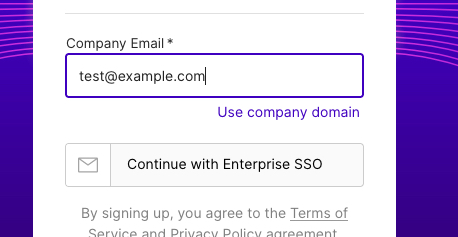

This guide outlines the steps for setting up Single Sign-On (SSO) for Insomnia Enterprise using Okta's OIDC integration, ensuring a secure and efficient user authentication process.

#### Configuring Insomnia Enterprise

- **Access Enterprise Controls:** In Insomnia, navigate to "Enterprise Controls."
- **Create SSO Connection:** Click to create a new SSO Connection.
- **SSO Configuration:** Set up your company domain in Insomnia and keep the page open to transfer details between Insomnia and Okta.

#### Creating a New Application Integration in Okta

1. **Navigate to Okta:** Go to Applications > Applications.
2. **Initiate the Integration:** Click on "Create App Integration".

   

3. **Choose Sign-in Method:** Select "OIDC - OpenID Connect" as the sign-in method.

   

#### Configuring the Application in Okta

1. **Transfer SSO Details:** Copy the SSO URL from Insomnia to Okta.

   

2. **Set Issuer:** Set the issuer in Okta.

   

3. **Transfer SSO Details:** Copy the client id, client secrets and the issuer URL from Okta to Insomnia.

   

4. **SSO Configuration in Insomnia:** Define your organization's domain identifier.

   

#### User Management

1. **Assigning Users in Okta:** Assign users to the application.

    

2. **Inviting Users in Insomnia:** Invite the same users in the Insomnia organization dashboard.

    

3. **User Onboarding:** Users can log in using Okta, set an encryption passphrase, and accept the enterprise invitation.

    

    

Follow these steps to successfully integrate Insomnia Enterprise with Okta SAML for a streamlined and secure SSO experience.
