This guide outlines the steps for setting up Single Sign-On (SSO) for Insomnia Enterprise using Okta's SAML integration, ensuring a secure and efficient user authentication process.

#### Creating a New Application Integration in Okta

1. **Navigate to Okta:** Go to Applications > Applications.
2. **Initiate the Integration:** Click on "Create App Integration".
   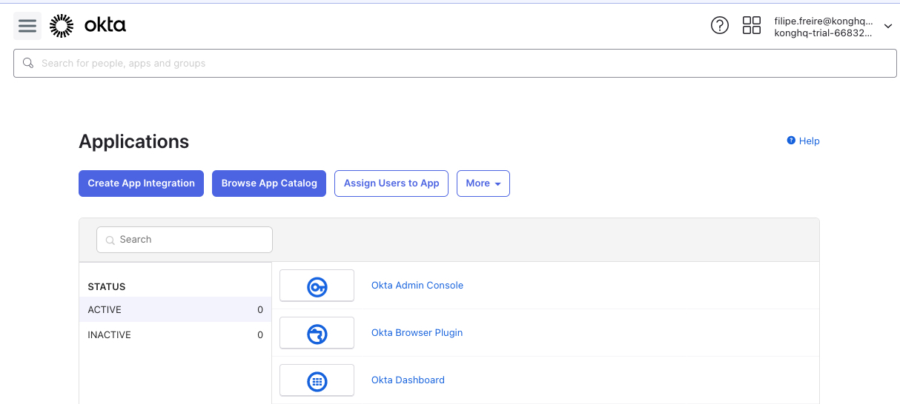
3. **Choose Sign-in Method:** Select "SAML 2.0" as the sign-in method.
   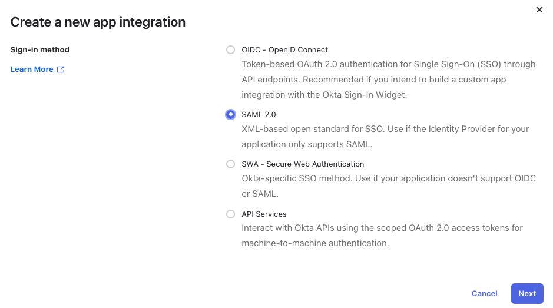

#### Configuring the Application in Okta

4. **General Settings:** Complete the general settings form and proceed.
   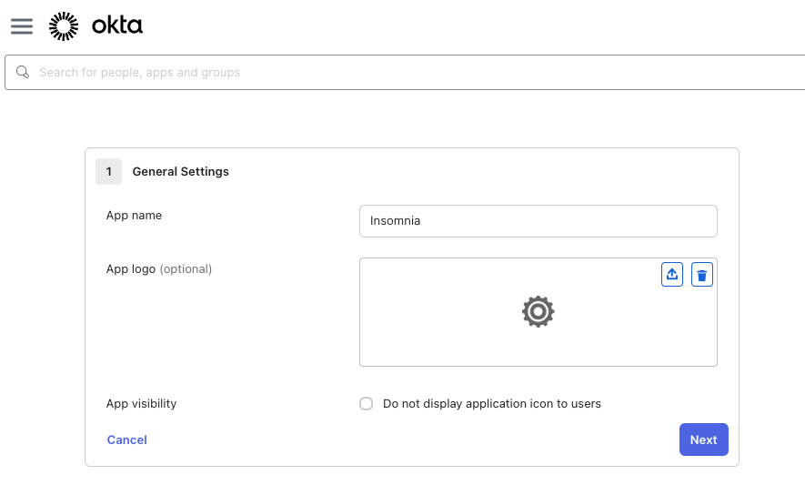
5. **SSO Configuration in Insomnia:** Define your organization's domain identifier.
   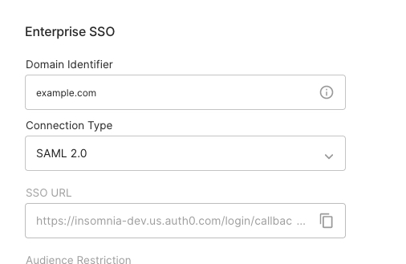
6. **Transfer SSO Details:** Copy the Single Sign-On URL and the Audience URI from Insomnia to Okta.
   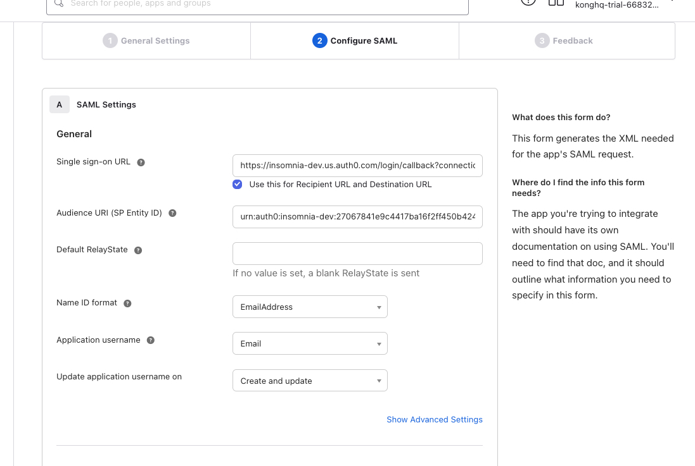
7. **Define Attributes:** Add an Attribute Statement. Set the name as `email` and map it to `user.email`. Complete the app integration setup.
   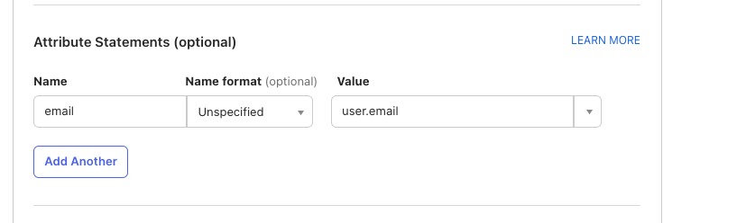

#### Setting up Insomnia Enterprise

8. **Finalize SSO Setup:** In Insomnia, paste the "Sign on URL" and the "Signing certificate" from Okta.
   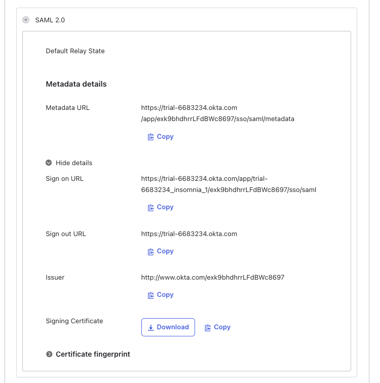
   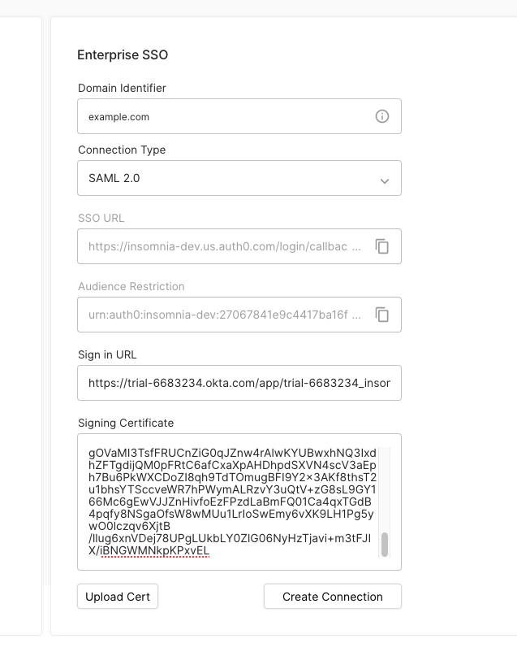
9. **Verify Connection:** Check for the message "Your SAML connection has been successfully updated" in Insomnia.
   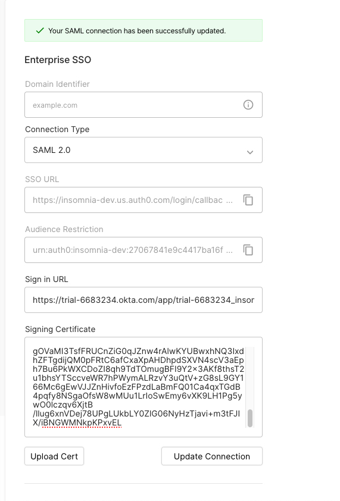

#### User Management

10. **Assigning Users in Okta:** Assign users to the application.
    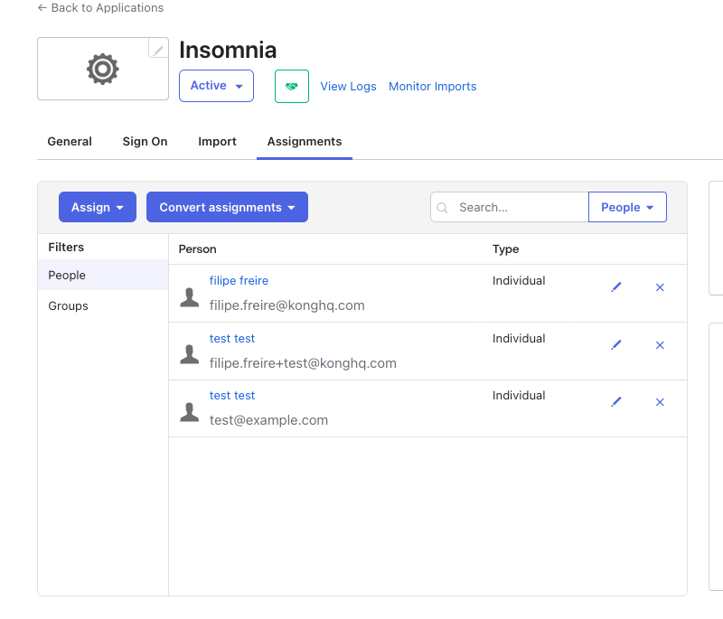
11. **Inviting Users in Insomnia:** Invite the same users in the Insomnia organization dashboard.
    
12. **User Onboarding:** Users can log in using Okta, set an encryption passphrase, and accept the enterprise invitation.
    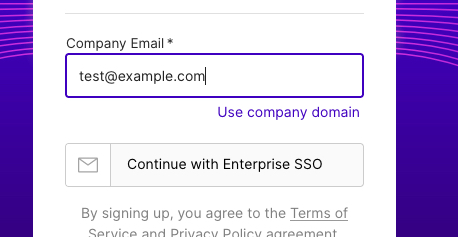
    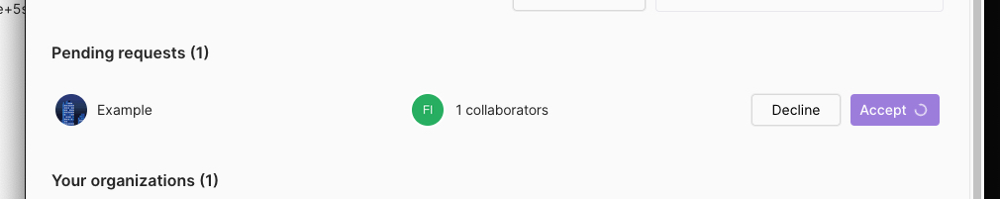

Follow these steps to successfully integrate Insomnia Enterprise with Okta SAML for a streamlined and secure SSO experience.
