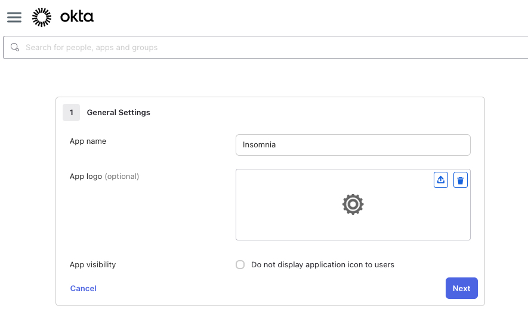
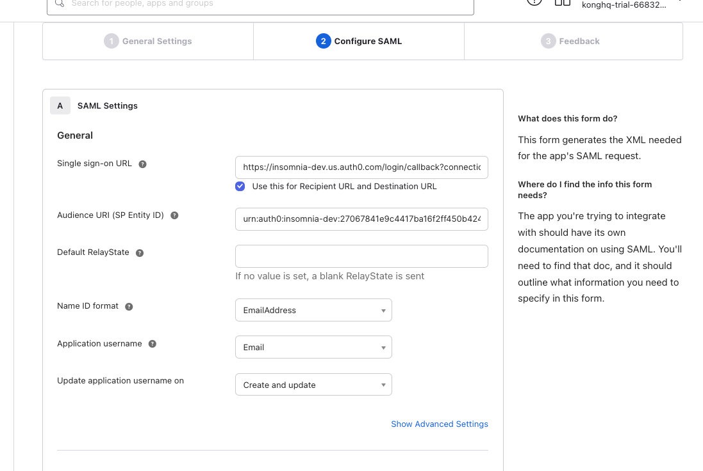
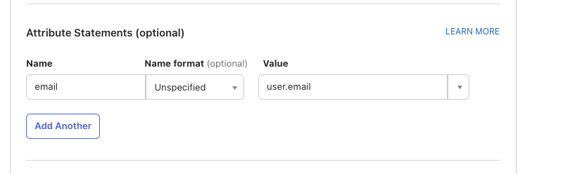
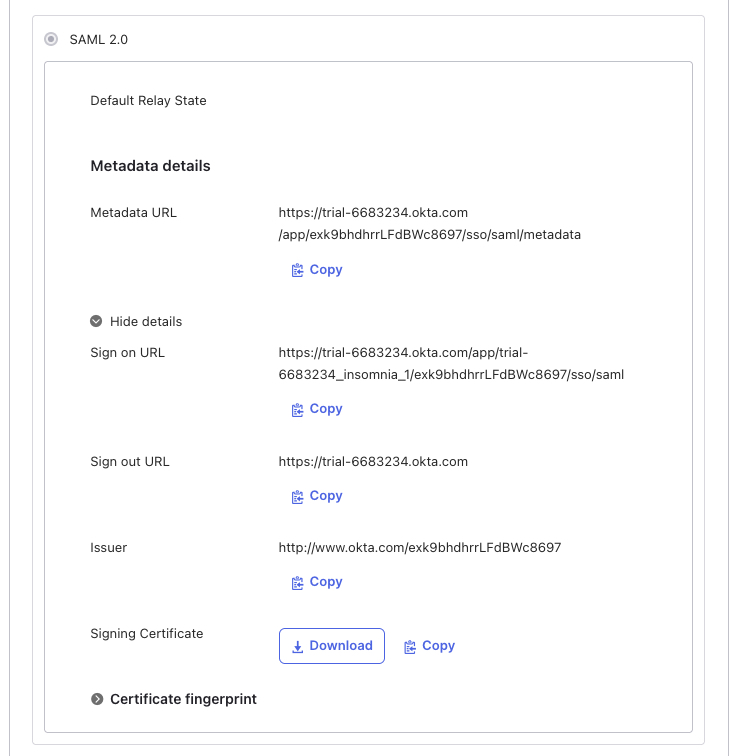
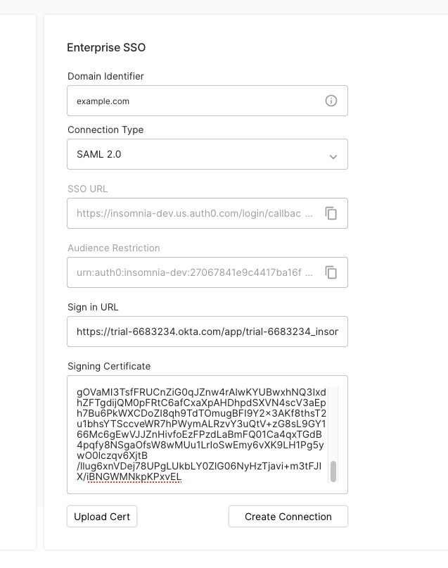

## Enabling Enterprise Membership in Insomnia

This guide provides step-by-step instructions on how to enable enterprise membership for your Insomnia API Client account.

### Prerequisites

- Ensure you have an existing account on the [Insomnia website](https://app.insomnia.rest/app/authorize).

### Step 1: Upgrade Account

1. Navigate to your account dashboard.
2. Click on the **Upgrade** button to initiate the upgrade process.

### Step 2: Activate Enterprise Membership

1. **With Activation Code:**
   - If you have an enterprise activation code, enter it in the provided field.
   - You should be able to preview the details of the enterprise plan after submitting it.
2. **Without Activation Code:**
   - If you don't have an activation code, [contact the sales team](https://insomnia.rest/pricing/contact) to obtain one.
3. After applying the activation code, click on **Upgrade Subscription**.

4. You will be redirected back to the organization dashboard.

### Step 3: Create Your Organization

1. Click on **New Organization** to start setting up your enterprise-enabled organization.

2. Enter a name for your organization.

3. Click on **Create Organization**.

### Step 4: View Organization Dashboard

1. After creating your organization, you should see it listed on your dashboard.

### Optional: Manage Your Organization

1. To manage your organization, click on the **Manage Organization** submenu option next to the organization you wish to configure.

2. In the organization setup page, you can invite members and configure additional settings, such as enabling Enterprise Edition Single Sign-On (EE SSO).

## Configuring EE SSO

To set up Enterprise Single Sign-On (SSO) using a major SAML 2.0 provider like Okta or Azure in the Insomnia, you need to configure several fields.

The process can slightly differ depending on the SAML provider, but here's a general guide that applies to most cases, using Okta and Azure as examples.

Before setting up Enterprise SSO, you will need

- An active enterprise account with Insomnia.
- An admin account on your SAML provider (e.g., Okta or Azure).
- An organization created after activating your Enterprise license within Insomnia.

### Steps

1. **Domain Identifier**
   - Enter your domain identifier, which is typically your company domain.
   - Example: `company.com`

2. **Connection Type**
   - Select `SAML 2.0` as the connection type.

3. **SSO URL (Callback URL)**
   - Use the SSO URL provided by Insomnia. This is the callback URL where the SAML response will be sent.
   - Example: `https://insomnia.example.com/callback`

4. **Audience Restriction (Entity ID)**
   - Enter the Audience Restriction or Entity ID provided by Insomnia.
   - Example: `urn:example:insomnia`

5. **Sign in URL**
   - For Okta: Navigate to your Okta admin dashboard, select your application, and find the "Sign on" section. Copy the "Identity Provider Single Sign-On URL."
   - For Azure: In the Azure Portal, under the Azure Active Directory section, go to "Enterprise applications" and select your application. Under "Single sign-on," find the "Login URL."

6. **Sign in Certificate**
   - For Okta: In the same section as the Sign in URL, you will find the "Identity Provider Certificate." Download it and paste the content or upload the file in Insomnia.
   - For Azure: Similarly, under "Single sign-on" in Azure, download the "SAML Signing Certificate" and paste or upload it in Insomnia.

### Additional Notes

- The specific navigation paths in Okta or Azure might vary slightly based on updates to their interfaces. Always refer to the latest documentation provided by your SAML provider.
- After setting up SSO in Insomnia, it's recommended to test the SSO process to ensure everything is functioning correctly.
- If you encounter issues, double-check the entered values, especially the SSO URL and the Certificate, as these are common points of error.

This guide aims to provide a general idea of the setup process. For provider-specific instructions, it's advisable to consult the documentation of Okta or Azure or your provider, as they might have particular requirements or additional steps.

### Example: Integrating Insomnia Enterprise with Okta SAML

This guide outlines the steps for setting up Single Sign-On (SSO) for Insomnia Enterprise using Okta's SAML integration, ensuring a secure and efficient user authentication process.

#### Creating a New Application Integration in Okta

1. **Navigate to Okta:** Go to Applications > Applications.
2. **Initiate the Integration:** Click on "Create App Integration".
   
3. **Choose Sign-in Method:** Select "SAML 2.0" as the sign-in method.
   

#### Configuring the Application in Okta

4. **General Settings:** Complete the general settings form and proceed.
   
5. **SSO Configuration in Insomnia:** Define your organization's domain identifier.
   
6. **Transfer SSO Details:** Copy the Single Sign-On URL and the Audience URI from Insomnia to Okta.
   
7. **Define Attributes:** Add an Attribute Statement. Set the name as `email` and map it to `user.email`. Complete the app integration setup.
   

#### Setting up Insomnia Enterprise

8. **Finalize SSO Setup:** In Insomnia, paste the "Sign on URL" and the "Signing certificate" from Okta.
   
   
9. **Verify Connection:** Check for the message "Your SAML connection has been successfully updated" in Insomnia.
   

#### User Management

10. **Assigning Users in Okta:** Assign users to the application.
    
11. **Inviting Users in Insomnia:** Invite the same users in the Insomnia organization dashboard.
    
12. **User Onboarding:** Users can log in using Okta, set an encryption passphrase, and accept the enterprise invitation.
    
    

Follow these steps to successfully integrate Insomnia Enterprise with Okta SAML for a streamlined and secure SSO experience.

### Example: Integrating Insomnia Enterprise with Azure SAML

> Example tutorial for Azure SAML coming soon.
