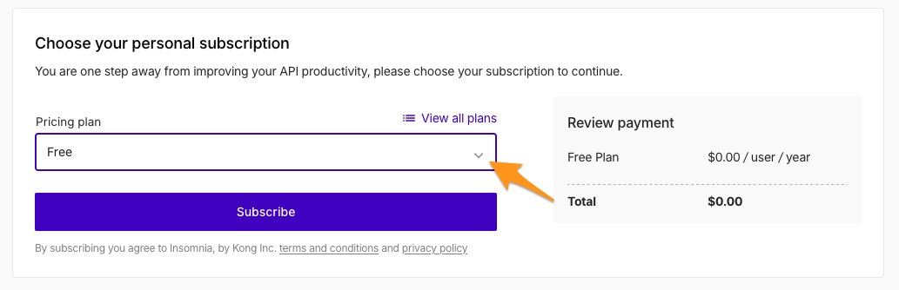
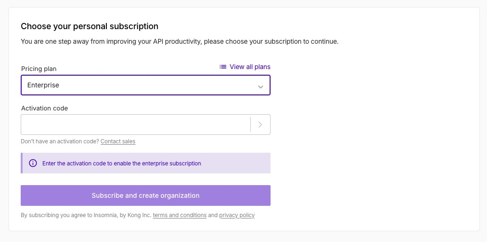

This guide provides step-by-step instructions on how to enable enterprise membership for your Insomnia API Client account.

### Step 1a: For new users - Create Account and pick Enterprise Plan

1. Follow the steps to [create an account](/insomnia/accounts#signing-up-from-the-insomnia-desktop-application)
2. After you create the account you should see a menu to pick a plan
   

3. Pick Enterprise plan and skip to Step 2 of this tutorial.
   

### Step 1b: For existing users - Upgrade Account Plan

1. Navigate to your account dashboard.
2. Click on the **Upgrade** button to initiate the upgrade process.

### Step 2: Activate Enterprise Membership

1. **With Activation Code:**
   - If you have an enterprise activation code, enter it in the provided field.
   - You should be able to preview the details of the enterprise plan after submitting it.
2. **Without Activation Code:**
   - If you don't have an activation code, [contact the sales team](https://insomnia.rest/pricing/contact) to obtain one.
3. After applying the activation code, click on **Upgrade Subscription**.

4. You will be redirected back to the organization dashboard.

### Step 3: Create Your Organization

1. Click on **New Organization** to start setting up your enterprise-enabled organization.

2. Enter a name for your organization.

3. Click on **Create Organization**.

### Step 4: View Organization Dashboard

1. After creating your organization, you should see it listed on your dashboard.

### Optional: Manage Your Organization

1. To manage your organization, click on the **Manage Organization** submenu option next to the organization you wish to configure.

1. In the organization setup page, you can invite members and configure additional settings specific to that organization.

## Configure Enterprise Single Sign-On (SSO)

To configure Enterprise SSO, refer to [this document](https://docs.insomnia.rest/insomnia/enterprise-configure-ee-sso).
