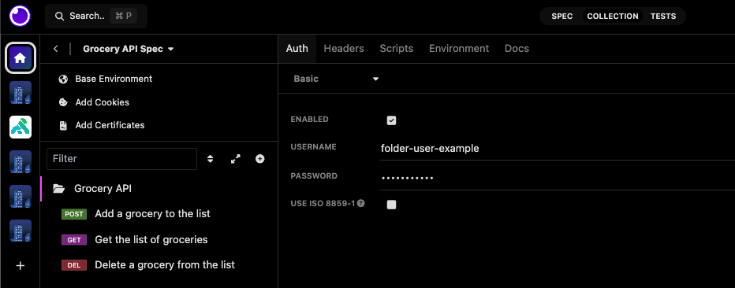

Starting with the [release of Insomnia 9.3.0](https://konghq.com/blog/product-releases/insomnia-9-3-ga), the concept of folder-level settings has been introduced.

It's now possible to set, on a folder level, the following:

- **Authentication**.
- **Headers**.
- **Pre-request and After-Response scripts**.
- **Environment variables**.
- **Docs**.

