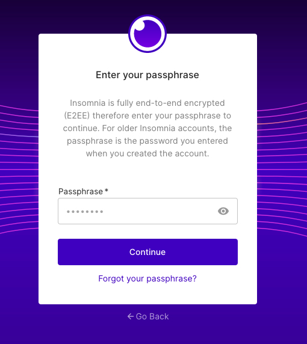
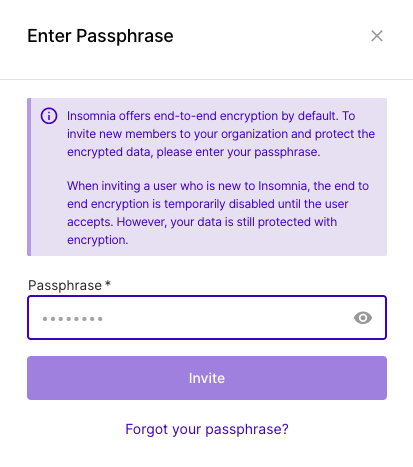
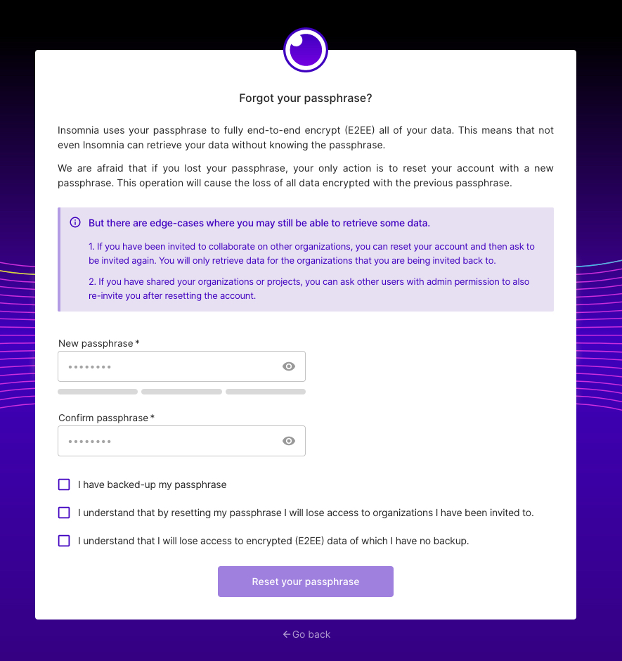

### Forgot Passphrase

Due to the usage of [SRP](https://en.wikipedia.org/wiki/Secure_Remote_Password_protocol) to handle data encryption of the Insomnia App, the Insomnia Cloud never stores a user's passphrase in any form.

In addition, the derivation of encryption keys based on the user's passphrase means that all user data (e.g. Requests, Collections, Environments, ...) is encrypted in a manner that requires the user's passphrase to decrypt.

When Insomnia passphrases are forgotten, this means that synced Insomnia data cannot be decrypted.  **Please create passphrases with care.**

### Warnings about resetting passphrase

We are afraid that if you lost your passphrase, **your only action is to reset your account with a new passphrase**. Keep in mind this operation will cause the **loss of all data encrypted with the previous passphrase**. Also be aware that:

- By resetting your passphrase you will lose access to organizations you have been invited to.
- You will lose access to encrypted (E2EE) data of which you have no previous or current backup.

## How to reset passphrase

You can reset passphrase when you attempt to login from the Insomnia App and/or when you invite someone into your organization.

By clicking on the "Forgot your Passphrase?" link you will be lead to the menu that allows for resetting passphrase.

Once in the reset passphrase menu, you will need to fill out a new Passphrase and confirm that:

- You have backed-up your new passphrase
- You understand that by resetting yor passphrase you will lose access to organizations you have been invited to.
- You understand that you will lose access to encrypted (E2EE) data of which you have no backup.

### Retrieving data after account passphrase reset

There are edge-cases where you may still be able to retrieve some data after a passphrase reset.

1. If you have been invited to collaborate on other organizations, you can reset your account and then ask to be invited again. You will only retrieve data for the organizations that you are being invited back to.

2. If you have shared your organizations or projects, you can ask other users with admin permission to also re-invite you after resetting the account.
