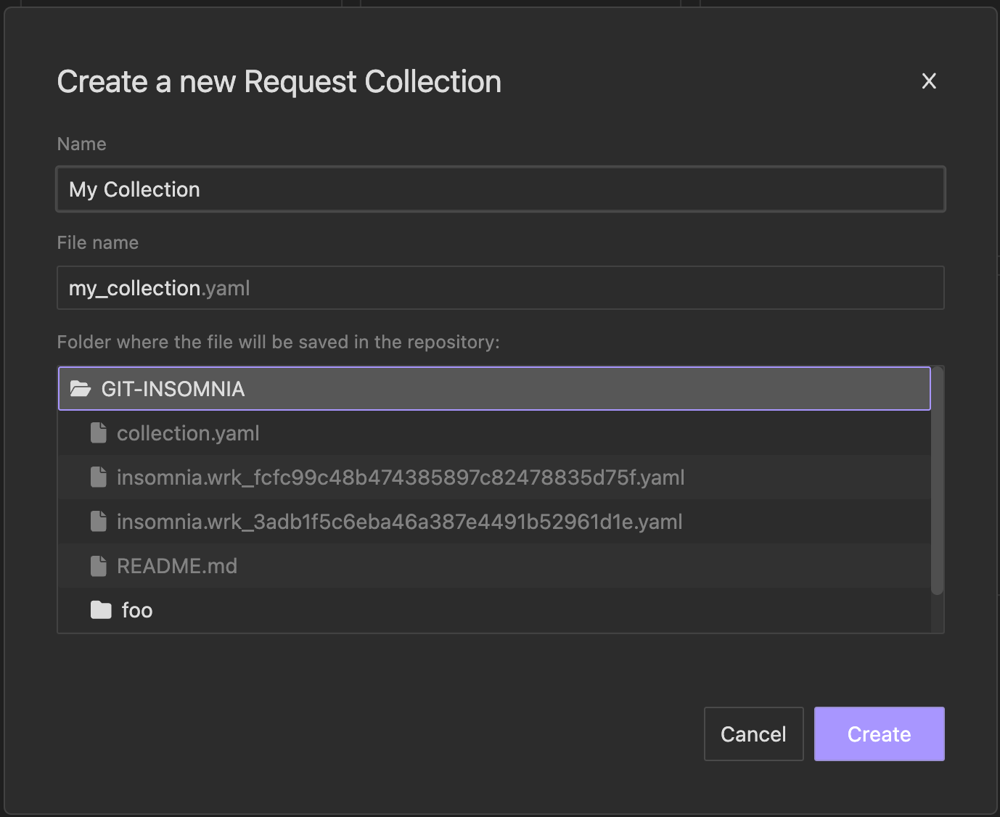

## Getting started with Git Projects:

{:.alert .alert-primary}
**Note**: Sync with Git applies to users subscribed to [Team plan](https://insomnia.rest/pricing) and above, refer to [pricing](https://insomnia.rest/pricing).

Within a Team/Enterprise organization, you can create or clone a remote Project from Git via the **Create Project** dropdown from the Dashboard:

### Adding a Git Project:

You need an existing remote git repo before you add a project of git-sync type.

To begin, click on the plus button:


Next on the **Create a New Project** modal select **Git Sync** from the options provided:


Then you will be asked to [configure the remote git repository](#remote-repository-settings):


After configuring the remote git repo url, Insomnia will clone and parse the files from the repo.


If there are existing insomnia v5 format yaml files, we’ll import these file to the newly created project.cou


## Updating a Git Project

You can update your Git project in several ways:

### Rename the Project
You can change the name of your project to better reflect its purpose.

- On the project list select your project and open the Project Settings modal

- Rename your project and press update

- The name of the project is not shared between users


### Switch Between Project Types  
You can switch your project to a Local Vault or Cloud Sync project if you decide to. This will not affect the remote repository but any changes that have been made in other branches rather than the current will be lost. Make sure you save and share your changes before switching the project type. Insomnia will ask for verification when switching between project types to make sure you don’t accidentally lose any data:


## Deleting a Git Project

If you need to delete a Git project, you can do so through the project settings. Ensure that you have backed up any important data before proceeding.

- On the project list find your project and select the delete action

- Verify that you want to delete your project


## Perform Git Operations

You can use the Git Sync Dropdown to do all sorts of git operations on your project. It appears in the sidebar when a Git project is selected or when navigating inside any of the project’s files.

- [Manage Branches](#manage-branches)

- History:

  - View history log of commits in current branch

- [Pull](#pull-changes)/[Push](#push-changes) changes

- Fetch changes to current branch

- [Commit](#commit-changes) changes


## How are Insomnia files stored in my repository?

Insomnia files are stored as YAML files with the .yaml extension for ease of storage and retrieval. You can chose the fileName alongside the folder where it will be stored when creating a new file from Insomnia:




## Migrating from the legacy Git Sync

To enhance your experience with Git, we are fully concentrating on Git Projects and transitioning away from the previous Git Sync functionality, which was restricted to a single file per repository.

**Existing files** linked to Git will continue to function as they have in the past, allowing you to retain your data and migrate to the new Git Projects at your own pace.


### How can I migrate an existing file that is linked to Git Sync to the new Git Projects?

To **share all the files from your existing project** using Git, you can **convert your current project into a Git Project**:

1. Access the project settings and choose Git Sync as the storage type.

2. Link it to your existing repository.

3. Keep in mind that all files within your project can now be synchronized using Git, allowing you to commit and push them to your repository effortlessly.

If you prefer **not to share all the files from your existing project** using Git, then you would need to **create a New Git Project**:

1. Begin by creating a new Git Project and linking it to your current repository.

2. Transfer your existing files to the newly created Git Project.

  - You can accomplish this by either exporting and importing your files, or

  - by utilizing the Duplicate action on the file and selecting your Git Project as the destination.

3. Commit and push your changes.
4. Finally, you can safely remove the legacy file from your existing Project.

## Using Inso CLI with Git Projects

The Inso CLI will supports passing an Insomnia file directly. For example, you can use the command:  

```sh
inso --file insomnia.workspace-1.yaml
```

This allows for seamless interaction with your Git projects through the command line.

## Remote Repository Settings

When configuring a remote repository, you can chose to connect with GitHub or GitLab, or manually set up a remote repository.

### Set up a remote repository with GitHub

1. Open a document in Insomnia, then click **Setup Git Sync** in the upper right corner of the Insomnia app.
2. Click "Configure Repository", then open the GitHub tab.
3. Click **Authenticate with GitHub App**. Your web browser should opened to the Insomnia website.
4. Click on **Continue**.
5. You might be prompted to continue by your browser through the Insomnia app via  "Choose Application" box.  If you are not, you can follow the instructions on the page to complete GitHub account authentication with the Insomnia App.
6. You can now clone repositories that the GitHub App has access to! Search for the repository you want to connect to and click **Clone**.

NOTE: If you cannot find the repository you want to connect to, you will need to ask the repository or organization owner to install the [Insomnia Desktop GitHub App](https://github.com/apps/insomnia-desktop).

### Set up a remote repository with GitLab

1. Open a document in Insomnia, then click **Setup Git Sync** in the upper right corner of the Insomnia app.
2. Click "Configure Repository", then open the GitLab tab.
3. Click **Authenticate with GitLab**. Your default browser will open and automatically redirect you to GitLab.
4. Click **Authorize** to allow Insomnia to connect with your GitLab account.

    If successful, you will be redirected to the Insomnia website with the message "Successfully authenticated Insomnia".
5. Return to the Insomnia app and wait for sync to finish.

6. You might be prompted to manually add your GitLab authentication to the Insomnia app. If you still see the option to manually paste in your GitLab authentication code, copy it from `app.insomnia.rest` into the Insomnia app, then click  **Sync**.
7. You can now clone any repository from GitLab! Copy the HTTPS URI for the GitLab repository you want to connect to and paste it into the "GitLab URI" field.

### Manually set up a remote repository

* **Git URI**: The URI of the Git repository. Only HTTPS URLs are officially supported.
* **Author Name**: The Git author name to store with each commit.
* **Author Email**: The Git author email to store with each commit.
* **Username**: The Git author username to match with the authentication token.
* **Authentication Token**: The token needed to authenticate with remote repository provider, such as GitHub or BitBucket. If you have two-factor authentication (2FA) enabled on your account, it is unlikely you will be able to use your username and password. Instead, generate a personal access token or app password with the scope outlined below.

### Token and App Password Scope

{:.alert .alert-primary}
**Note**: You may fail to set up Git Sync properly due to not enough or the wrong types of Git permissions.

Find instructions on how to create a personal access token or app password on the following platforms:

* [GitHub](https://docs.github.com/en/github/authenticating-to-github/keeping-your-account-and-data-secure/creating-a-personal-access-token)
  * Ensure that the token has the `user:email` scope in order to correctly associate commits with your GitHub account.
  * For public repos, select [`public_repo`](https://github.com/settings/tokens/new?description=insomnia-git-sync&scopes=public_repo,user:email) when creating your token.
  * For private repos, select [`repo`](https://github.com/settings/tokens/new?description=insomnia-git-sync&scopes=repo,user:email) when creating your token.
* [Gitlab](https://docs.gitlab.com/ee/user/profile/personal_access_tokens.html)
  * For public and private GitLab repos, scope at least `api` when creating your personal access token.
* [Bitbucket](https://support.atlassian.com/bitbucket-cloud/docs/app-passwords/)
  * For _private_ BitBucket repos, scope at least `Read` and `Write` in the `Repository` options when creating your app password.
* [Bitbucket Server](https://confluence.atlassian.com/bitbucketserver/personal-access-tokens-939515499.html)

Once complete, click **Done** and the repository settings will be persisted for future operations. The author details and token can be updated as needed.

## Manage Branches

When working with Git, it's good practice to make changes in separate branches. This has two benefits:

* Reduces the chances of merge conflicts when collaborators are making frequent changes
* Supports a pull-request workflow where collaborators can leave feedback before merging
Local branches can be created from the branch management dialog. This dialog presents both local branches and remote branches.

{:.alert .alert-primary}
**Note**: Remote branches will only appear if they do not already exist locally.

## Commit Changes

Commit your changes via the branch dropdown menu. You'll be prompted to add a descriptive message as your commit message.


## Push Changes

Pushing your changes to your remote repository for the first time creates the `.insomnia` directory, which you can use with the [Inso CLI](/inso-cli/introduction#data-search-flow).

{:.alert .alert-primary}
**Note**: If you'd like to push to an alternative branch than the default, click on the branch dropdown menu. Select **Branches**, and add your desired branch name.

Commits and branches only exist locally when created. A push needs to be done to share the commits and history of a branch remotely. If pushing fails, you will be given the option to force push.

The push or force push operation can fail for many reasons, and logs will be presented in the Developer Console prefixed with `git-event` with further debugging information. A likely cause is that your user does not have permissions to push to a protected branch.

For instance, with GitLab, the main/master branch is protected by default, and those with the developer role are unable to push directly to it. In that case, push to a separate branch and create a pull request, or update the permissions for your user on the repository.

## Pull Changes

If a collaborator makes a change to the remote repository, pull the changes to access the work locally. Click the branch dropdown menu in a Document and then **Pull**. Any incoming changes will be merged to your local machine.

## Sign out of Git account

Sign out of a synced Git management account.

1. Click on **Setup Git Sync**, then click on **Repository Settings**.
2. You should see a list of all synced accounts. Next to each account is a **Sign Out** button. Click on **Sign Out** for the accounts that need to be signed out.
3. In the box that appears, click **Sign Out** again.

The **Configure Repository** box will no longer list the account that was signed out in its list of configured accounts.
