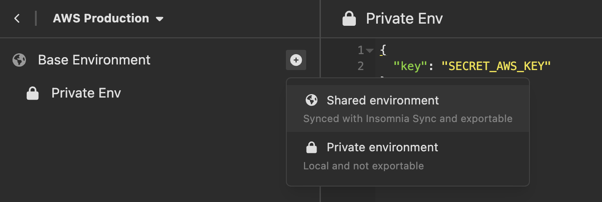
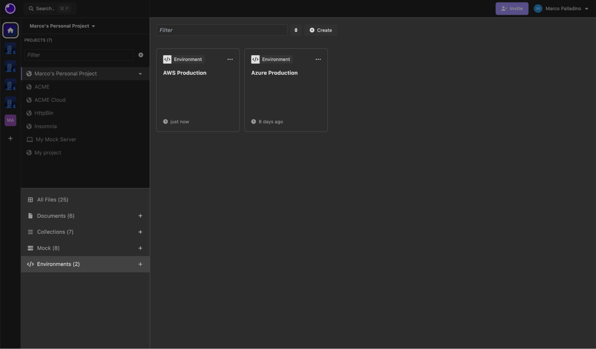
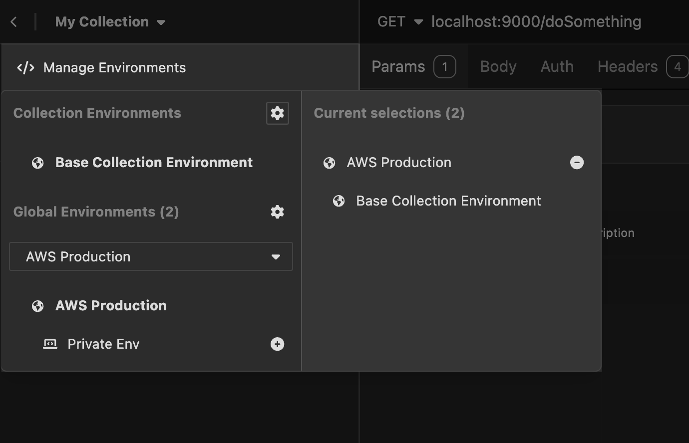

Starting with the [release of Insomnia 9.3.0](https://konghq.com/blog/product-releases/insomnia-9-3-ga), the concept of Global Environments has been introduced.

Global environments can be defined on a Project level and can be used across multiple collections, including the ability to leverage them in pre-request and after-response scripting.

You can create as many global environments as you wish, so you aren't limited to only one, and decide to store them locally on your computer, or leverage Cloud Sync or Git Sync for collaboration (based on your storage settings for your projects).

