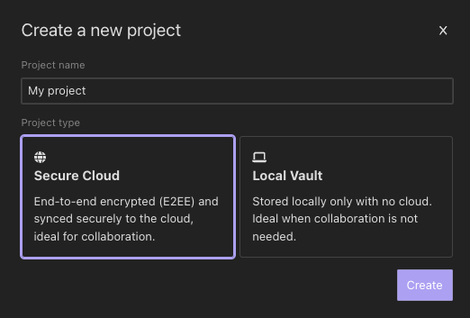

## Introduction

Insomnia offers various storage options to cater to different user needs and preferences. Understanding these options is crucial for efficient and secure management of your API projects. This document outlines the three primary storage options available in Insomnia: Local Vault, Cloud Sync, and Git Sync.

## 1. Local Vault

### Overview

Local Vault is a storage option that allows all project data to be stored locally on your device. This option is ideal for users who prefer or require their data to remain off the cloud for privacy or security reasons.

### Key Features

- **Local Storage**: All project files are stored on your local machine.
- **No Cloud Interaction**: No data is sent to or stored in the cloud.
- **Security**: Enhanced security as data remains within your local environment.
- **Independence from Internet**: Access and work on your projects without needing an internet connection.

### Use Cases

- Organizations with strict data privacy regulations.
- Users working on sensitive projects that require enhanced security.
- Environments with limited or restricted internet access.

## 2. Cloud Sync

### Overview

Cloud Sync enables users to store and synchronize their project data in the cloud securely. This feature is beneficial for collaboration, providing easy access to projects from different devices and locations.

### Key Features

- **End-to-End Encryption (E2EE)**: Ensures data is encrypted during transmission and storage.
- **Real-Time Synchronization**: Keeps your projects up-to-date across all devices.
- **Collaboration**: Share and collaborate on projects with team members.
- **Remote Access**: Access your projects from anywhere with an internet connection.

### Use Cases

- Teams requiring collaboration on API projects.
- Users who work from multiple locations or devices.
- Projects that benefit from centralized, cloud-based management.

## 3. Git Sync

### Overview

Git Sync allows users to use a third-party Git repository for storing project data. This option is independent of cloud access and is suitable for users familiar with Git workflows.

{:.alert .alert-primary}
**Note**: Sync with Git applies to users subscribed to [Team plan](https://insomnia.rest/pricing) and above, refer to [pricing](https://insomnia.rest/pricing).

### Key Features

- **Version Control**: Leverage Git's version control capabilities for your projects.
- **Independence from Insomnia's Cloud**: Uses external Git repositories for storage.
- **Flexibility**: Choose any Git service provider like GitHub, GitLab, or Bitbucket.
- **Collaboration via Git**: Collaborate with others using standard Git practices.

### Use Cases

- Users comfortable with Git and its versioning system.
- Projects that require detailed version tracking and rollback capabilities.
- Teams that already use Git for other aspects of their development workflow.

## Conclusion

Understanding these storage options enables you to choose the most suitable one based on your project requirements, collaboration needs, and security preferences. Insomnia's flexibility in offering Local Vault, Cloud Sync, and Git Sync ensures that it can adapt to a wide range of user scenarios, from individual developers to large organizations.

> Looking for something else? See information on [Scratch Pad](scratchpad).
