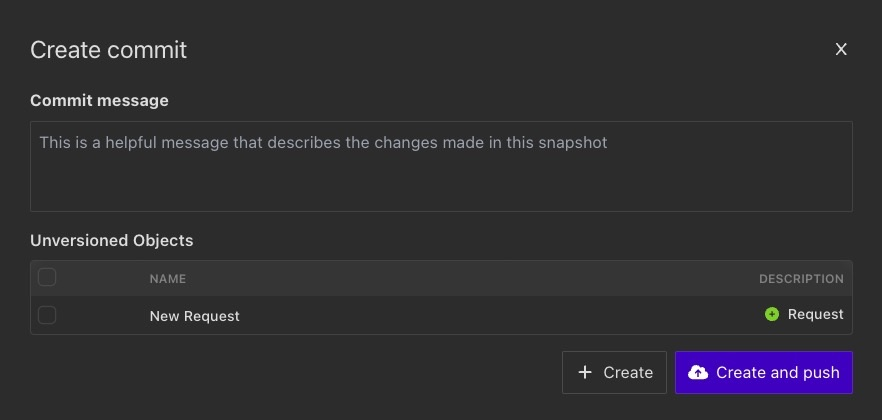

In this section, you will find documentation on [Cloud Sync](#cloud-sync) and [Commits](#commits).

## Cloud Sync

Cloud sync provides the following abilities on top of the base Insomnia functionality:

* Commit and push the contents of projects
* Revert to a previous commit
* Share commits across devices or with members of your organization
* Create and work on separate branches

## Enabling sync for projects

When creating a new project you will be prompted to pick the **Project Type**.

Any collections and design documents under a **Secure Cloud** project type will be automatically synced into Insomnia cloud.

## Syncing workspaces from Cloud projects

When navigating in a Cloud project you should see Un-synced collections, design documents or mock servers which you can pull from.

## Commits

This section provides information for Secure Cloud Projects. For pricing information, see our [Pricing](https://insomnia.rest/pricing) page.

### Create Commit

To create a Commit, open a **remote Collection/Design Document** and click on the branch dropdown menu next to Preferences, and then click **Commit**.

_Within a remote Collection/Design Document, click on the branch dropdown and click on Commit._

A **Create Commit** modal will open.

Commits represent all data in a Collection/Design Document (requests, folders, environments) at a specific point in time. Besides the data within the Collection, a Commit also details:

* The Commit author
* The time that the Commit was created
* A message describing any changes in the Commit

Creating a Commit requires two actions:

1. Describe the changes contained within the Commit
2. Select which changes to include

### Write a Commit Message

Commit messages should describe the included changes in as much detail as possible, as this description will help identify the Commit if you ever need to revert back to it.

### Add Changes to a Commit

Changes made to a request collection/design document can be added on a granular level. Modifications and deletions to existing requests, folders, etc (AKA objects) will appear under  Modified Objects, while new additions will appear under Unversioned Objects and are unselected by default.

### Share Commits

Once a Commit is created, it can be shared to your Insomnia account or team. There are two ways to push Commits:

* Use the Create and Push option when creating the Commit
* Push un-synced Commits from within the main sync menu

If there are new Commits available that do not yet exist on your device (eg. from a team) these will be available to pull down from within the sync menu.

### Work with Branches

All Commits created for Sync are stored in a branch. Branches are identified by name and each one maintains a list of Commits that have been created for it (ie. its history). Branches can be created or deleted at any time, shared with team members, and even merged together.

Branches can be useful for many reasons, but the two main use cases are the following:

* Separate personal work from other team members
* Work on experimental changes that may or may not exist long-term

Branches are managed within the branches dialog. Here, you can create local branches, merge branches, and fetch remote branches.

### Revert to a Previous Commit

You can revert a Collection/Design Document to a previous Commit. Find the Commit you want to revert to by going to the branch dropdown and clicking on **History**. Then click **Restore** on the Commit you want to revert to.

When you restore a Commit, it will show the changes locally and you'll need to manually Commit the changes.

## Things to Know

If a team is using mixed versions of Insomnia, and one version supports a type of request (such as gRPC or WebSockets) that another version doesn't, then syncing that request type to a synced Collection/Design Document with Insomnia Cloud may cause the request to be silently deleted when the collection/Design document is pulled and updated by different members using different Insomnia versions.

We highly recommend that teams be on the latest version of Insomnia to avoid losing request data due to version incompatibilities.
