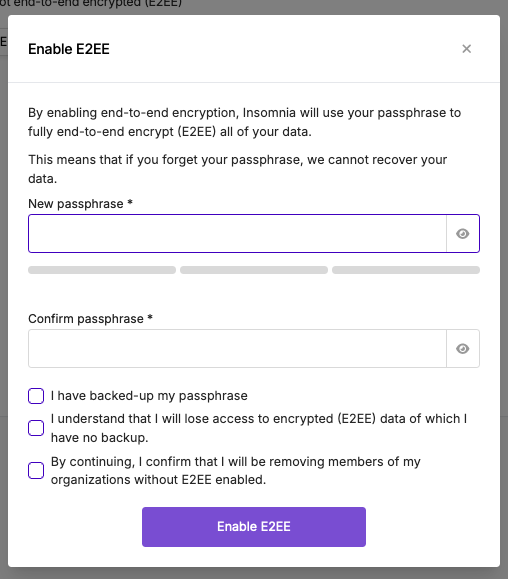
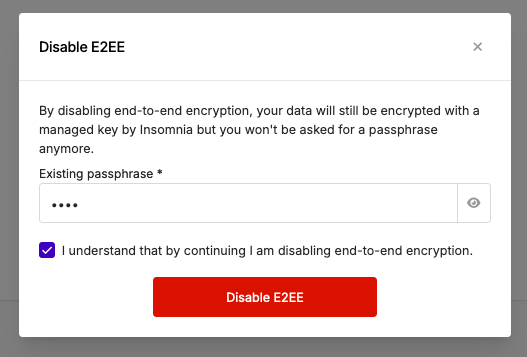

This tutorial will guide you through enabling or disabling E2EE in the Insomnia app, along with some critical considerations about handling your passphrase.

By default, accounts created from June 4th 2024 onwards with a free subscription have E2EE disabled. While your data remains encrypted at rest and in transit, E2EE offers an additional layer of security by encrypting data such that only the parties involved in the communication can decrypt it.

### Enabling E2EE

If you decide you want the additional security layer of E2EE, follow these steps to enable it:

#### Step 1: Access Account Settings

- **Log in** to your Insomnia App.
- Navigate to **Account Settings**, usually accessible from the dropdown menu under your account name.

#### Step 2: Navigate to Encryption Settings

- Once in Account Settings, look for the **Encryption** section.
- Click on **"Encryption"** to access the encryption options.

#### Step 3: Enable E2EE

- In the Encryption section, you will find an option to **Enable E2EE**.
- Click on **"Enable E2EE"** to start the setup process.

#### Step 4: Set Up Your Passphrase

- Once you enable E2EE, you will be prompted to **define a passphrase**. Enter your desired passphrase.
- **Confirm your passphrase** by entering it again. Ensure it is strong and memorable.

When enabling E2EE, there are several important factors to consider:

- **Backup Your Passphrase**: Always keep a backup of your passphrase in a secure location. Without it, you cannot recover your data.
- **Data Loss Risks**: Losing your passphrase means losing access to any encrypted data for which you do not have a backup.
- **Impact on Organizational Access**: If you own or are part of an organization within Insomnia, enabling E2EE will remove any users from your organization who do not have E2EE enabled.

### Disabling E2EE

If you decide you don't want to maintain passphrase any longer or make use of the additional security layer of E2EE, follow these steps to disable it:

#### Step 1: Go to Encryption settings

- **Log in** to your Insomnia App.
- Navigate to **Account Settings**, usually accessible from the dropdown menu under your account name.
- Once in Account Settings, look for the **Encryption** section.
- Click on **"Encryption"** to access the encryption options.

#### Step 2: Disable E2EE

- In the Encryption section, you will find an option to **Disable E2EE** next to an option to **Reset passphrase**.
- **Confirm your current passphrase** and then disable it.

Keep in mind: By disabling end-to-end encryption, your data will still be encrypted with a managed key by Insomnia but you won't be asked for a passphrase anymore.
