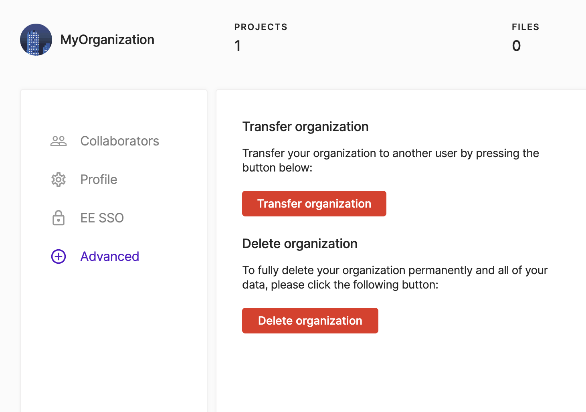
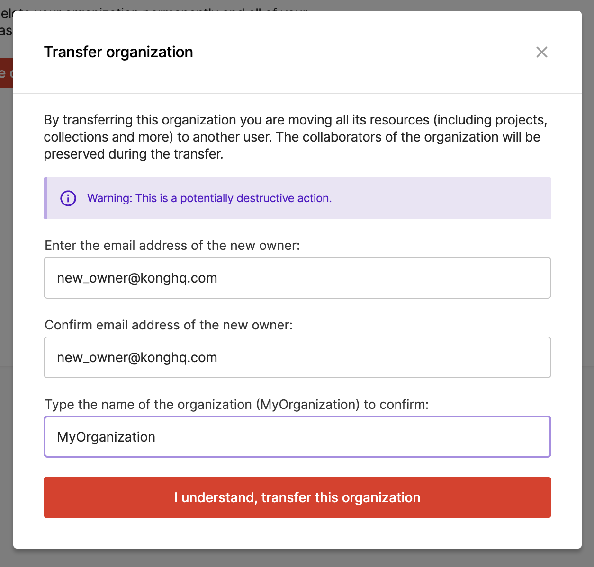
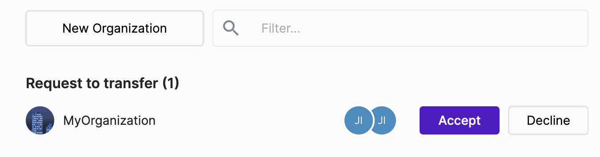

Insomnia Organizations allows Insomnia Users to share Collections and Environments [safely](https://docs.insomnia.rest/insomnia/signup-and-auth) and [securely](https://docs.insomnia.rest/insomnia/data-encryption) with their colleagues using Insomnia Cloud.

Members of an organization can make [commits](https://docs.insomnia.rest/insomnia/insomnia-sync#create-commit) and set up [branches](https://docs.insomnia.rest/insomnia/insomnia-sync#work-with-branches) for their collections. They can also view commits and branches from other members.

## How to Create an Organization

To start a new organization, visit the Insomnia Dashboard and click on the "**New Organization**" button.

Then, enter the organization's name and click "**Create**".

Note: To make a new organization, users must have a [Team or Enterprise plan](https://insomnia.rest/pricing).

## How to Invite Users to Your Organization

If you want to add members, go to the Organization's dashboard and type in the email addresses of the people you want to invite.

Check the "**Pending**" tab to see the invites that are still waiting for a response.

Remember, when adding new members, you'll need to input your [encryption passphrase](forgot-passphrase.md).

## User Permission Settings

Organization Owners and Administrators can change other member roles.

They can also remove members or invite new ones.

## How to Transfer an Organization

An organization owner is able to transfer the organization to another organization member.

Before transferring an organization, please make sure that following preconditions are satisfied:

- The new owner is a member of the organization to transfer.
- The new owner has an equivalent or higher subscription compared to the current owner, and contains enough seats.
- All organization invitations are revoked.
- The EE SSO connection is disabled, and it can be enabled after transfer.

The current owner can start a transfer by: 

- Click “Manage Organization”
- Chose “Advanced” tab
- Click “Transfer Organization” button
- Fill in the new owner’s email and organization name for confirmation.

Then the new owner will find transfer requests in both dashboard and email, after clicking the “Accept” button, the organization transfer will be executed. And the new owner is also able to decline if the transfer is unexpected.

