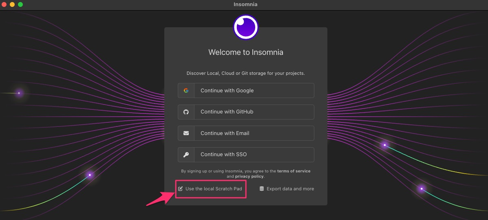
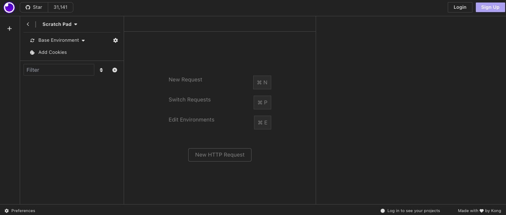
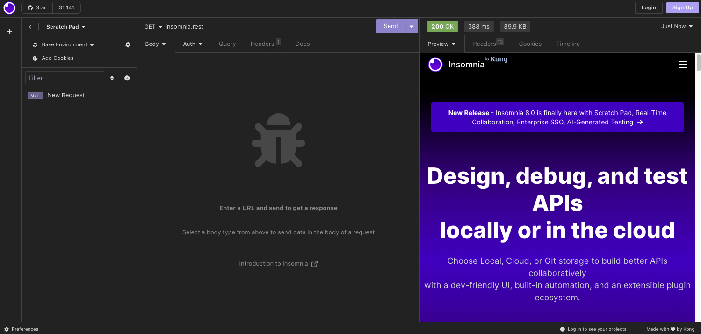

## Introduction

The Scratch Pad feature in Insomnia is a powerful tool for quickly experimenting with API requests without requiring a User account and/or affecting your account's existing Local/Cloud projects or workspaces.
It's ideal for testing, debugging, or learning purposes.
This tutorial will guide you through using the Scratch Pad feature effectively.

## Accessing Scratch Pad

1. **Open Insomnia Application**: Launch Insomnia on your device.

    

2. **Find Scratch Pad**: In the Insomnia interface, look for the Scratch Pad option. It's typically located in the sidebar or top menu, depending on your version.

    

## Using Scratch Pad

### Creating a New Request

1. **Create Request**: In the Scratch Pad area, click on 'New Request'.
2. **Name Your Request** (optional): Give a descriptive name to your request for easy identification.
3. **Choose Request Type**: Select the type of request (GET, POST, PUT, DELETE, etc.) from the dropdown menu.
4. **Enter URL**: Type in the API endpoint you wish to test.

    

### Setting Up Request Parameters

1. **Add Headers**: If your API requires headers (like content-type, authorization tokens), add them in the 'Headers' tab.
2. **Configure Body** (for POST/PUT requests): In the 'Body' tab, choose the appropriate format (like JSON, form data) and input the data you want to send.

### Sending the Request

1. **Send Request**: Once your request is set up, click the 'Send' button.
2. **View Response**: The response from the API will be displayed in the pane below the request configuration. You can view the status code, response body, headers, and more.

## Managing Scratch Pad Requests

- **Save Request**: You can save your request for later use by clicking 'Save'.
- **Organize Requests**: If you have multiple requests, organize them for easy access and reference.
- **Delete or Edit**: Requests can be deleted or edited as needed.
