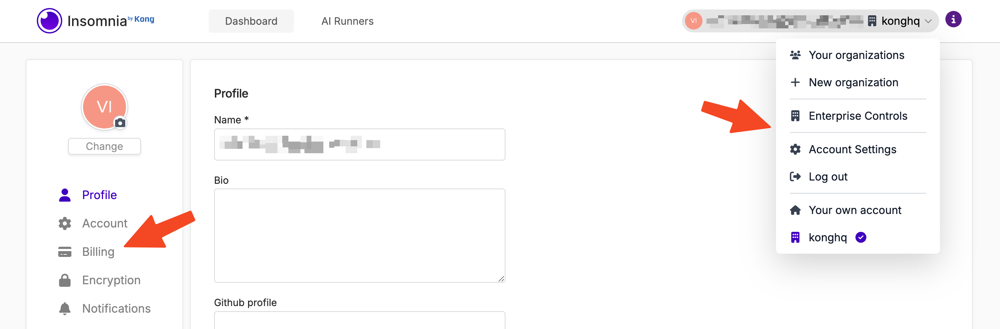
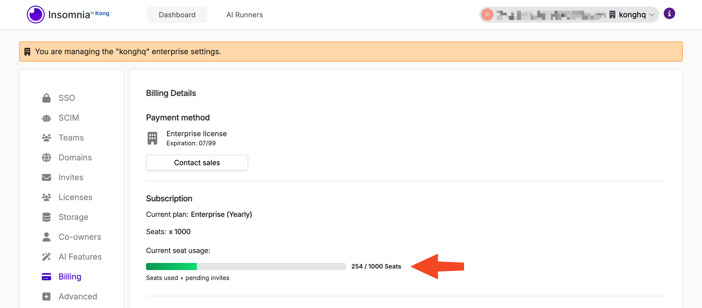
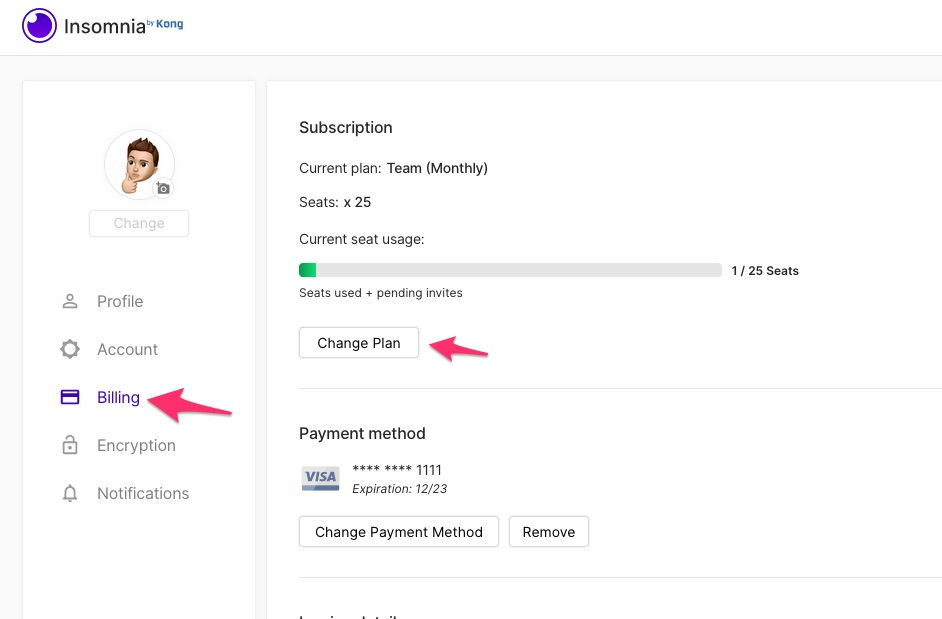

## View Subscription Details

Users can view their current plan, the total number of seats in the subscription, and the number of seats currently in use by navigating to the—depending on your plan—"Account Settings" or "Enterprise Controls" page and then to the "Billing" section.

The **Current seat usage** displays the combined total of users across all Organizations and pending invites. Invites remain valid in perpetuity, and need to be rescinded in order to reclaim the seat.

## Change Plan

For those looking to alter their subscription—whether to upgrade, downgrade, or terminate it—or to modify the number of seats associated with their plan, please follow the steps below:

1. Navigate to [Insomnia Account Settings](https://app.insomnia.rest/app/settings/profile).
2. Proceed to **Billing**.
3. Click on **Change Plan**.

