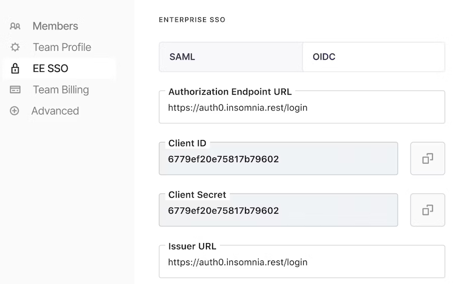

Insomnia offers a range of subscription plans catering to different needs for using Insomnia organizations. Detailed pricing is available [here](https://insomnia.rest/pricing).

Below is a concise description of each plan.

### Basic (Free) Plan

Upon registration with Insomnia, users receive a personal organization.

Users on the [Free plan](https://insomnia.rest/pricing):

- May invite countless collaborators to their personal organization, given there's only one project.
- Alternatively, they can maintain multiple projects individually.

### Individual Plan

Users with the [Individual plan](https://insomnia.rest/pricing) are exempted from the restrictions of the Free plan. They can invite any number of collaborators to any number of projects.

### Team Plan

The [Team plan](https://insomnia.rest/pricing) encompasses all features of the Individual plan, with additional benefits:

- Ability to create unlimited organizations;
- Integrated Git support;
- Role-Based Access Control (RBAC) and permission settings.

### Enterprise Plan

The Enterprise Plan encompasses all the benefits of the Team plan, further enhanced with:

- Enterprise Single Sign-On (SSO) support including SAML, OIDC;
- Dedicated enterprise-level support;
- Access to Kong Professional Services;
- Customizable payment methods.

