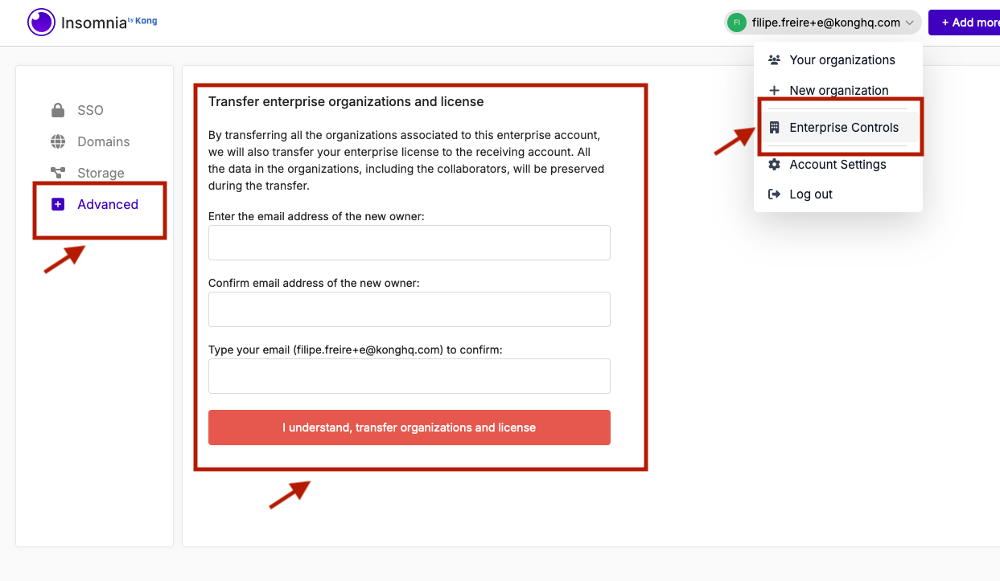

If you are an enterprise owner using the Insomnia app and need to transfer your ownership and license to a new owner, follow these simple steps to ensure a smooth transition.

## Step 1: Access Enterprise Controls

- **Log in** to your Insomnia App account.
- Navigate to the **Account dropdown** in the upper right corner of the interface.
- Click on **"Enterprise Controls"** to open the management settings.

## Step 2: Go to Advanced Settings

- Within the Enterprise Controls, find and select the **"Advanced"** tab.
- This section allows you to manage more intricate settings of your enterprise account.

## Step 3: Transfer Ownership and License

- In the Advanced settings, you will see an option to **"Transfer License and Ownership"**.
- Click on this option to initiate the transfer process.

## Step 4: Enter the New Owner's Information

- You will be prompted to enter the **email address of the new owner**. Enter this information carefully.
- **Re-enter the email address** to confirm it. This helps prevent any mistakes in the email address of the new owner.
- Then, enter your current email address to verify your identity as the current owner.

## Step 5: Confirm the Transfer

- After entering all necessary information, you will see a confirmation button.
- Click on **"I understand, transfer organizations and license"** to finalize the transfer.
- This action will transfer all organizational and licensing details to the new owner's account.

## Final Check and Confirmation

- Once you have completed these steps, Insomnia App will typically send a confirmation email to both you (the current owner) and the new owner. Make sure both parties receive this email.
- Confirm that the new owner can access the enterprise controls by having them log in and check their access.
- The new owner needs to accept the transfer invite on their account.
